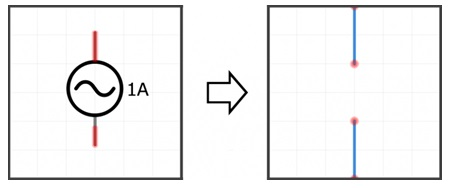
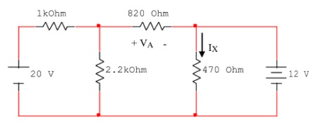
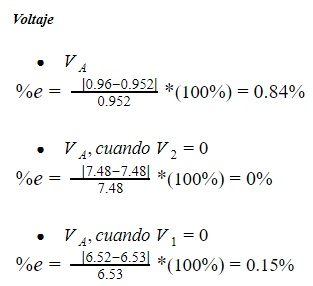
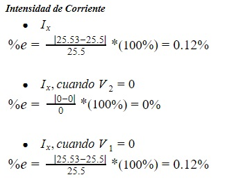
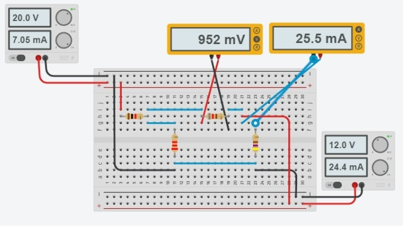
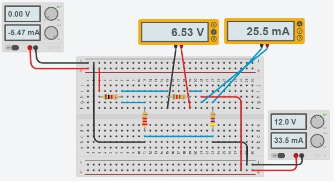

# PRÁCTICA No. 4 Teorema de Superposición

**Integrantes:**

CALDERON VIDAL MATEO ESTEBAN

CAMACHO SIZA JOSUE EVERETT

GUEVARA CARVAJAL LUIS EDUARDO

**NRC:**

5406

### Objetivo

*Objetivo General*

- Comprender el Teorema de Superposición, para determinar los voltajes y las corrientes presentes en un circuito eléctrico.

*Objetivos Especificos*

- Comprobar la efectividad del uso del teorema de superposición para el análisis de circuitos.

- Realizar comparaciones entre los datos teóricos usando el teorema de superposición y los datos prácticos adquiridos en el desarrollo de la práctica.

- Entender las conexiones y forma de uso del protoboard, del multímetro y de los   demás materiales de laboratorio para hacer un uso correcto de ellos, ya que cada uno tiene una forma específica de uso.

### Marco Teórico

El teorema de superposición establece que, el efecto dos o más fuentes de voltaje y/o corriente tienen sobre un punto cualquiera en un circuito lineal, es igual a la suma de cada uno de los efectos de cada fuente tomados por separado, sustituyendo todas las fuentes de voltaje restantes por un corto circuito y las fuentes de corriente por circuitos abiertos.

El teorema de superposición ayuda a encontrar:

- Valores de tensión, en una posición de un circuito, que tiene más de una fuente de tensión y/o corriente.

- Valores de corriente, en un circuito con más de una fuente de tensión y/o voltaje.

Para usar el teorema de superposición para el análisis de circuitos eléctricos, siga los pasos enlistados a continuación:

Teorema de superposición pasos:

1. Identificar las Fuentes independientes

2. Escoge una fuente y “apaga” las demás,cuando apagues una fuente de corriente se tomará en su lugar un corto circuito o un cable abierto.

En cambio, si apagas una fuente de voltaje se tomará en su lugar un cable.

3. Calcula el voltaje y la corriente

Se tiene que hacer cálculos por separado de cada fuente de manera independiente.

4. Repita los dos pasos anteriores para cada fuente independiente

5. Realiza la sumatoria

Vx=∑Vx

### Explicación del procedimiento

*Material y equipo requerido*

*Tabla I. Materiales y Equipo*

*Pasos a seguir*

1. Iniciar el Tinkercad y seleccionar los materiales a utilizar.

2. Preparar los materiales en el simulador: resistencia con cada valor y las fuentes de energía.

3. Elaborar un circuito con las cinco resistencias con la forma indicada en la guía.

4. Medir cada uno de los voltajes, corrientes y anotar los resultados.

5. Analizar el circuito por el teorema de superposición para obtener los resultados analíticos de cada voltaje y de cada corriente.
 
6. Completar las tablas respectivas con cada uno de los resultados obtenidos.

*Procedimiento*

*Figura 1.- Circuito para comprobar el Teorema de Superposición.*

Redibujando el Circuito para:

### Resultados

*Tabla II. Medición de voltaje aplicando superposición.*

*Tabla III. Medición de corriente aplicando superposición*

*Porcentaje de error relativo entre los valores teóricos y los experimentales*

*Análisis de los resultados*

- El teorema de superposición permitio evaluar los datos proporcionados por cada una de las fuentes en las diferentes resistencias del sistema, para luego sumar estos datos y hallar los verdaderos valores proporcionados en el circuito.

- Se pudo determinar que si la fuente no es la ideal está se cortocircuita, pero se deja introducida en el circuito eléctrico.

- Se observo que tanto los resultados analizados como los calculados son iguales sin ningun margen de error.

### Video

### Conclusiones

### Anexos

*Anexo 1.- Circuito en Tinkercad.*

*Anexo 2.- Circuito en Tinkercad.*

*Anexo 3.- Circuito en Tinkercad.*

### Bibliografía

Campomanes, J. G. (1990). Circuitos Eléctricos. Oviedo: Servicio de publicaciones Universidad de Oviedo.

Gallego, J. R. (2008). Universidad Tecnológica Pereira. Obtenido de Universidad Tecnolgica Pereira: http://repositorio.utp.edu.co/dspace/bitstream/handle/11059/1042/6213192G166.pdf?sequence=1&isAllowed=y

Pereda, J. A. (Mayo de 2018). Unican. Obtenido de Unican: https://personales.unican.es/peredaj/pdf_apuntes_ac/presentacion-teoremas.pdf
